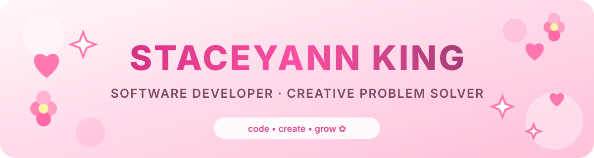

  

  

  
  </a>
  
  

---

## 🌸 About Me

Hi, I’m **Staceyann King**, a New York–based software developer and computer science student who enjoys combining technology, creativity, and meaningful problem-solving.

- 🎓 Studying **Computer Science and Applied Mathematics** at CUNY City Tech
- 💻 Building responsive full-stack applications and interactive user experiences
- 📊 Exploring **data science with Python and R**
- 🔐 Growing my knowledge of **Data Science**
- 🌱 Currently strengthening my data structures, algorithms, and cloud skills
- 💖 I love turning creative ideas into useful, welcoming digital experiences

---

## 🎀 Tech Stack

### Languages

  
  
  
  
  
  

### Frontend

  
  
  
  
  
  
  

### Backend, Data & Tools

  
  
  
  
  
  
  
  

---

## 💕 Selected Work & Projects

### 💻 OddCommon Website — Web Developer Internship

`Svelte` · `JavaScript` · `Three.js` · `GSAP` · `DatoCMS` · `REST APIs`

- During my internship, contributed frontend work to a website recognized as a **2025 Webby Winner for Best Practices** and **Best Home Page nominee**.
- Built interactive features and animations, integrated CMS content through REST APIs, and improved frontend performance.

🌐 [Live website](https://oddcommon.com) · 🏆 [Webby recognition](https://winners.webbyawards.com/2025/websites-and-mobile-sites/features-design/best-home-page/336323/oddcommon-website)

### 🎨 ArtStream — Artist Discovery & Events Platform

`Ionic React` · `TypeScript` · `Tailwind CSS` · `React Router`

- Collaborated with a team to build a full-stack platform for discovering artists and events.
- Developed artist profiles, event filtering, responsive navigation, and reusable RSVP, volunteer, and event-creation modals.

### 🎬 Celebrity Name Chain

`TypeScript`

- Built an interactive game that challenges players to connect celebrities through shared names.

💻 [View repository](https://github.com/Staceyannking/Celebrity-Name-Chain)

---

## ✨ Experience Highlights

- **Software Development Resident · NYC Tech Talent Pipeline** — Built full-stack and data projects using JavaScript, Python, and R while collaborating with a technical team.
- **Web Developer Intern · OddCommon** — Developed interactive frontend experiences with Svelte, JavaScript, Three.js, GSAP, REST APIs, and DatoCMS.
- **IT Help Desk Intern · NYC DSS/HRA** — Supported users, troubleshot hardware and software issues, and documented service requests.
  
## 🎓 Education & Training

| | Program |
|---|---|
| 🎓 | **CUNY City Tech** — Computer Science and Applied Mathematics |
| 🌷 | **NYC Tech Talent Pipeline** — Software Development Residency |
| 📈 | **SV Academy** — Sales Development Representative Program |
| 💻 | **The Marcy Lab School** — Software Engineering Fellowship |

---
## 🌷 My GitHub Journey

  <em>A little snapshot of what I’ve been building and learning ✨</em>

  

  
  

---

  <strong>Thanks for visiting my profile! Let’s build something beautiful. 💗</strong>

